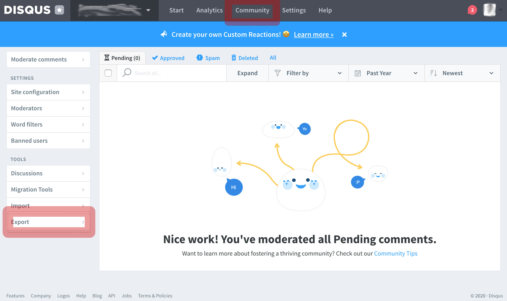
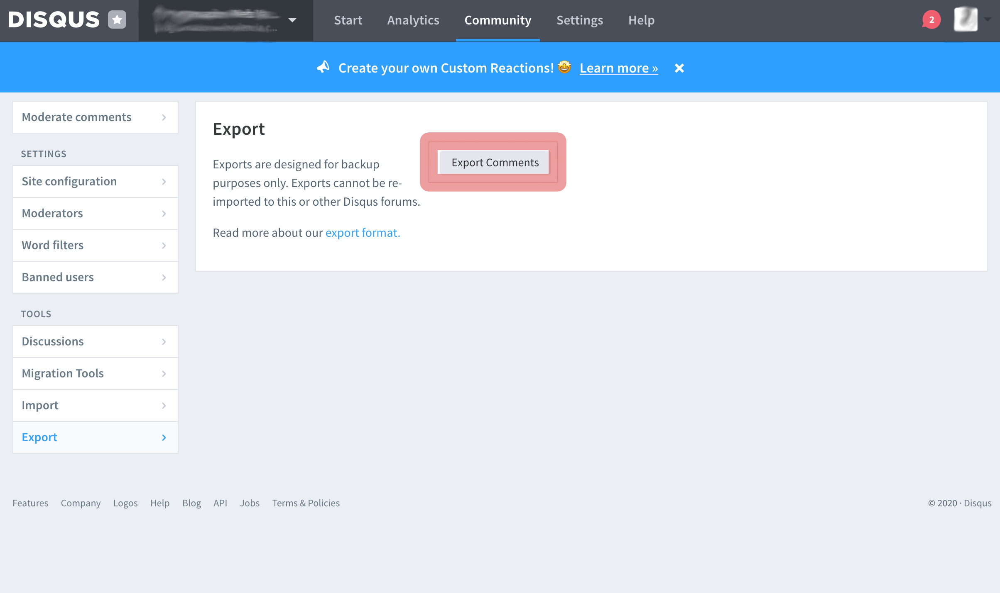

# glosa-disqus-import

Export comments from Disqus (XML format) to a simple JSON.

``` json
[
  {
    "id": 2166957614,
    "parent": 29293782,
    "createdAt": 1352672642,
    "author": "Quijote",
    "thread": "https://programadorwebvalencia.com/clojure-que-es-y-para-que-sirve/",
    "message": "<p>Curioso sí que parece...</p>"
  },{
    "id": 2166957615,
    "parent": 51293771,
    ...
```

Superpowers:

- Transform dates to unix time.
- It unifies the children and the comments.
- Keep the reference to the parents.
- It removes irrelevant data.

## Prerequisites: export the comment XML from Disqus

1) Enter the Disqus Administrative panel.


2) Enter to Community.



3) Click in Export.



You will receive an email with all the compressed comments.

## Usage

1) Download `dist/glosa-disqus-import-x.x.x-standlone.jar`.

2) Decompress Disqus export.

3) Runs.

``` bash
java -jar glosa-disqus-import-x.x.x-standlone.jar [file]
```

Example

``` bash
java -jar glosa-disqus-import-x.x.x-standlone.jar myblog-2020-03-04T18%3A36%3A47.800594-all.xml
```

In the same directory you will create the JSON.
